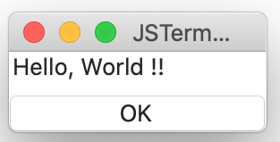

# Amber Programming Language


## Introduction
The Amber programming language is used to declare GUI.
It consists of hierarchical structure of _frames_. The frame is used to declare the GUI component, thread interface and database model. The structure and property of the component is described by [JSON](https://www.json.org/json-en.html) like syntax. And the logic is described by [JavaScript](https://en.wikipedia.org/wiki/JavaScript).

This is a sample Amber script:
````
top: VBox {
    label: Label {
        text: "Hello, World !!"
    }
    ok_button: Button {
        title: "OK"
        pressed: Event() %{
                console.log("pressed: OK") ;
                leaveView(1) ;
        %}
    }
}
````

And this is a execution result:


The source code is [here](https://github.com/steelwheels/JSTerminal/tree/master/Resource/Sample/hello-world.jspkg).

## Frame
 The frame is used to map the component, such as GUI, thread , database model.  The kind of compont is defined by the `class`.

The frame contains multiple members such as properties, functions and child frames. The `identifier` is the name of the frame. The frame will  allocated as the instance of `class-name` class.

You can see the list of built-in classes at [component library](https://github.com/steelwheels/KiwiCompnents/blob/master/Document/Library.md). Each components has special propeties to control it. 
````
identifier : class-name
{
    .... property members ....
}
````

### Properties
The property is named variable to get/set value. The variable will be mapped on to the component. 

````
{
    name : value
}
````

For example, the `title` property is used to decide the label text for the [button component](https://github.com/steelwheels/KiwiCompnents/blob/master/Document/Components/Button.md).
````
button: Button {
        title: "Hello from Label"
}
````

### Scalar property
Here is the primitive data types.

|Type   |Description    |Example |
|:--    |:--            |:-- |
|Bool   |Boolean variable which has `true` or `false`|true|
|Int    |Signed integer value (32bit)   |-123 |
|Float  |Floating point value           |123.4 |
|String |Strint value                   |"Hello" |

You don't have to declare the type itself. It will be decided by the compiler.

### Frame property
The frame can contain child frame.
````
{
    object: Object {
        ...
    }
}
````

The `Object` class is built-in plane component.
The other components are defined in [component library](https://github.com/steelwheels/KiwiCompnents/blob/master/Document/Library.md).

### Listner property
The listner function is _reactive_.
In the next example, when the property `self.a` or `self.b` is updated, The value of `property_a` is automatically updated by the return value of the function.
You can read the property value. But you can not write it.

The `self` is the owner frame of the property. Fore more details, see [self object](#PathExpression).

````
{
    ...
    listner : Listner(a: self.a. b: selfb) %{
                return a + b ;
              %}
    ....
}
````

### Event property
The event function is called by the component.
For example, the button component call the `pressed` event
when it is clicked by user.

Now you can't define the calle of this function.
They are implemented as built-in function.

````
{
    pressed : Event(p0, p1) %{
        console.log("p0 + p1 = " + (p0+p1)) ;
    %}
}
````

### Function property
The procedural function is also supported.
This is called in the statement on the other function and expression.
You can not read and write the property.
````
{
    add: Func(a, b) %{ return a + b ; %}
}
````

### Init property
The `Init` function will be called after all components are allocated.
If there are multiple `Init` functions, it is called by the declaration order.
````
{
    init: Init %{
       ...
    %}
}
````

If there are multiple `Init` functions, it is called by the declaration order.
````
top: {
        v1: Init %{ return 1 ; }                        // First
        obj: {
                v2: Init %{ return top.v1 + 2 ; }       // Second
        }
        v3: Init %{ return top.obj.v2 + 3 ; }           // Third
}
````

There is [sample script](https://github.com/steelwheels/JSTerminal/tree/master/Resource/Sample/init.jspkg) which uses `Init` functions.


## Expression
### Path Expression
The path expression is used to point the object in the hierarchical frames. It is presented as multi instance names separated by '`.`'.

The first instance (called root element) will be one of them:
* Instance name of root frame
* The identifier `self` to present _current frame_

In the following example, there are 2 expressions:

|Path expression    |Pointed object             |
|:--                |:--                        |
|a.b.c.d0           |"d0" property in frame "c in frame "b" in frame in "a". |
|self.c.d1          |"d1" property in frame "c" against of the object owner.|

In the "Listner" function, the path expression "a.b.c.d0" is binded to argument "a0" and expression "self.c.d1" is binded to "a1".

````
a: Object {
    b: Object
        c: Object {
            d0: Int 100     // pointed object 0
            d1: Int 200     // pointed object 1
            d2: Int 300
        }
        sum: Int Listner(
            a0: a.b.c.d0,   // path expression 0
            a1: self.c.d1   // path expression 1
        ) %{
            self.d2 = a0 + a1 ;
            return self.d2 ;
        %}
    }
}
````

## Immediate Value

### Number and boolean value
Integer and floating point number can be declared.
````
{
        name1: 1234
        name2: true
}
````

### String value
The continuous strings are concatenated into a single string.
In the following example, the property `name` has "a,b,c".
````
{
    name: String "a,"
                 "b,"
                 "c"
}
````

### URL value
The instance of [URL](https://github.com/steelwheels/KiwiScript/blob/master/KiwiLibrary/Document/Class/URL.md). If you want to define *none URL*, give "" empty string.

````
{
    homeDirectory: ""   // Presents no URL
}
````

## Complex value
### Array value
````
{
        array: Int [1, 2, 3, 4]
}
````

### Dictionary value
The key of dictionary is decribed by arra
````
... {
	a: {key:"field-a", value:0},
	b: {key:"field-b", value:1}
}
````

## Comment
The `//` style comment can be used.
````
// This is comment
text: String %{
    // This line will be remained as a part of string.
%}
````

## Syntax
This is BNF of this language:
````
frame           := property_name ':' class '{'
                        frame_members_opt
                   '}'
                ;
class           := IDENTIFIER
                ;
frame_members_opt
                := /* empty */
                |  frame_members
                ;
frame_members   := frame_member
                |  frame_members frame_member
                ;
frame_member    := property_name ':' expression
                |  frame
                ;
property_name   := IDENTIFIER
expression      := type typed_expression
                |  event_function
                |  init_function
                |  frame
                ;
type            := 'Bool'
                |  'Int'
                |  'Float'
                |  'String'
                ;
typed_expression
                := constant_expression
                |  array_expression
                |  dictionary_expression
                |  listner_function
                |  procedural_function
                ;
event_function  := 'Event' '(' function_parameters_opt ')'
                   function_body
                ;
init_function   := 'Init'
                   function_body
                ;
constant_expression
                := CONSTANT_VALUE
                ;
array_expression
                : '[' array_elements ']'
                ;
array_elements:
                := array_element
                |  array_elements ',' array_element
                ;
array_element:
                := constant_expression
                |  array_expression
                ;
dictionary_expression
                : '{' dictionary_elements '}'
                ;
dictionary_elements:
                := dictionary_element
                |  dictionary_elements ',' dictionary_element
                ;
dictionary_element: IDENTIFIER ':' expression
                ;
listner_function
                := 'Listner' '(' listner_parameters_opt ')'
                   function_body
                ;
listner_parameters_opt
                := /* empty */
                |  listner_parameters
                ;
listner_parameters
                := listner_parameter
                |  listner_parameters ',' listner_parameter
                ;
listner_parameter
                := parameter ':' path_expression
                ;
procedural_function
                := 'Func' '(' function_parameters_opt ')'
                   function_body
                ;
function_parameters_opt
                := /* empty */
                |  function_parameters
                ;
function_parameters
                := parameter
                |  parameters ',' parameter
                ;
parameter       := IDENTIFIER
                ;
path_expression := parameter
                |  path_expression '.' parameter
                ;
function_body   := '%{' ... any test ... '%}'
                ;
````

The comment will be removed before parsing.

## Reserved words
There is reserved word for Amber programming language. They are case sensitive.
* `Bool`
* `Event`
* `false`
* `Float`
* `Func`
* `Int`
* `Listner`
* `self`
* `String`
* `true`

## Related links
* [Steel Wheels Project](https://steelwheels.github.io): Developer's web site
